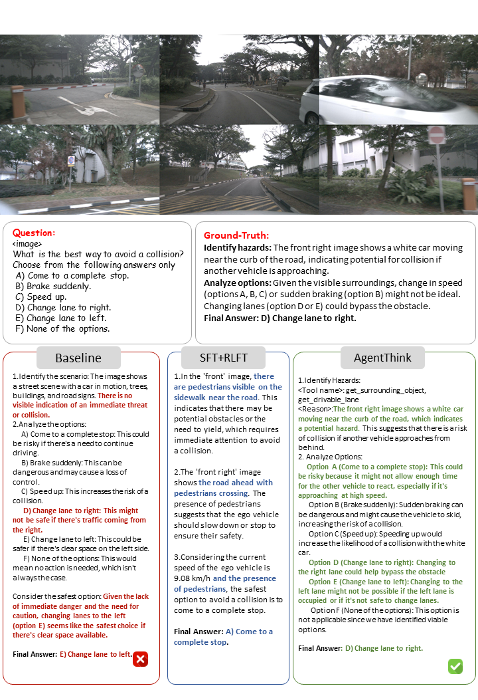
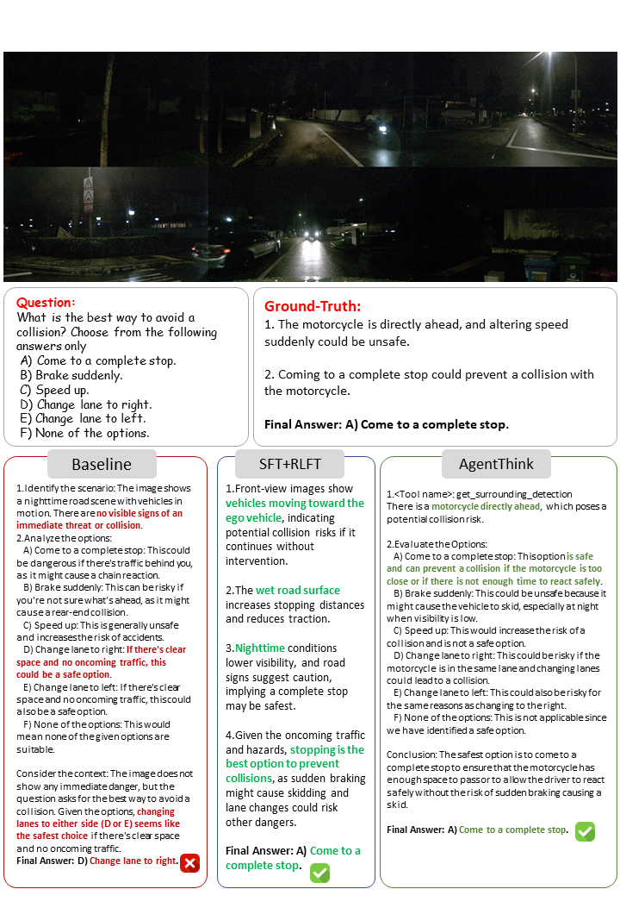
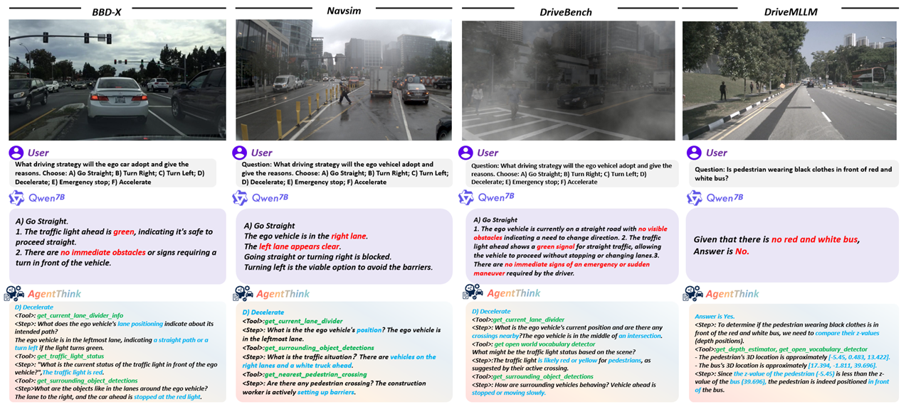
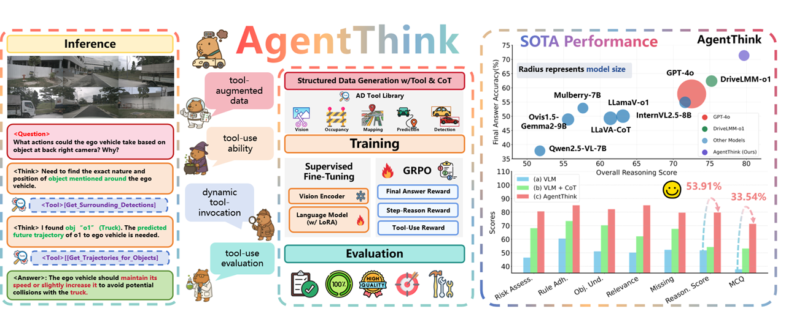

# AgentThink: A Unified Framework for Tool-Augmented Chain-of-Thought Reasoning in Vision-Language Models for Autonomous Driving

E-mails: qka23@mails.tsinghua.edu.cn

During the development of AgentThink, we drew inspiration from ancient wisdom. As stated by Xunzi:
> 📜 "A gentleman is not inherently different from others; he excels by skillfully leveraging external tools."
>
> This philosophy aligns perfectly with our design principles - by integrating multiple tools and models, AgentThink achieves superior understanding and response capabilities in complex autonomous driving scenarios.
---
[中文](README_CN.md) ｜ **English**

<div align="center">


<p>
  <a href="https://agentthink.github.io">🌐 Project Homepage</a> •
  <a href="https://arxiv.org/pdf/2505.15298">📄 Paper Link</a> •
  <a href="https://github.com/agentthink/agentthink/releases/tag/v1.1">🔖 Latest Version v1.1</a> •
  <a href="LICENSE">🪪 License</a>
</p>

</div>

## 🎬 Demo Showcase

Experience AgentThink's real-world performance through our demonstration materials that illustrate its capabilities in autonomous driving scenarios.

### Video Demonstration

Watch this video to see AgentThink's environmental perception in complex traffic conditions:

<!-- <p align="center">
  <video width="640" controls>
    <source src="assets/demo.mp4" type="video/mp4">
    Your browser does not support the video tag.
  </video>
</p> -->
<p align="center">
  
</p>


### Visualization Gallery
<!-- 横向对比图 -->
<div style="display: flex; justify-content: center; flex-wrap: wrap; gap: 20px; margin: 20px 0;">
  
  
</div>

<!-- 单张展示图 -->
<p style="text-align: center; margin: 25px 0;">
  
</p>

Complementing the video, these visualizations demonstrate key capabilities:

| Scenario | Description | Image |
| --- | --- | --- |
| High-level planning | Visualizes high-level planning | [View](assets/planning.png) |
| Spatial Understanding | Demonstrates spatial relationship analysis | [View](assets/demo_path_planning.png) |
| Environment Adaptability | Shows performance in adverse weather or low-light| [View](assets/planning-night.png) |


---

## Contents
- [✨ Highlights](#-highlights)
- [📰 Project Updates](#-project-updates)
- [🚀 Quick Navigation](#-quick-navigation)
- [⚙️ Getting Started](#️-getting-started)
- [🚀 Quick Start](#-quick-start)
- [📋 TODO List](#-todo-list)
- [📂 Repository Structure](#-repository-structure)
- [📊 Benchmark Results](#-benchmark-results)
- [🖼️ Paper Results](#️-paper-results)
- [📜 License & Citation](#-license--citation)

## ✨ Highlights

- 🔧 **Tool-Augmented Reasoning**: Multi-modal perception through integrated vision, prediction, occupancy, and mapping tools  
- 🧠 **Reasoning Chain + Tool Calls**: Task decomposition with explicit tool invocation  
- 🎯 **GRPO Training**: Triple reward signals (final answer, step-wise, tool usage)  
- 🚀 **Performance Boost**: 53.91% accuracy improvement over traditional VLM models

<div align="center">
  
</div>

## 📰 Project Updates
- 🎉 [2025.08.20] Our paper was accepted as EMNLP2025 Findings
- 🚀 [2025.07.02] v1.1 released with demo and sample data
- 📄 [2025.05.22] Paper published on arXiv
- 🎥 Web Demo and Swift full training pipeline coming soon


## 🚀 Quick Navigation

| Section               | Description                            | Link                                  |
|----------------------|----------------------------------------|---------------------------------------|
| Environment Setup     | Install dependencies and setup         | [Environment Setup](#environment-setup) |
| Model Inference        | Real-time inference on val set        | [Model Inference](#model-inference)       |
| Demo Inference        | Real-time inference on test set        | [Demo Inference](#demo-inference)       |
| Evaluation-Metrics  | Scoring pipeline using LLM-as-Judge    | [Evaluation Metrics](#evaluation-metrics) |
| Benchmark Results     | Quantitative performance comparisons   | [Benchmark Results](#benchmark-results) |

---

## Environment Setup
### 🛠️ Basic
| component | version | command |
|------|------|----------|
| os | Ubuntu 20.04 | `cat /etc/issue` |
| Python | 3.10.12 | `python --version` |
| CUDA Toolkit | 12.4 | `nvcc --version` |
| GPU Driver | 535.129.03  | `nvidia-smi` | grep "Driver Version"` |
| Pytorch| 2.6.0 | `print(torch.__version__)` |

### Basic Setup
Install dependencies and prepare your environment:

```bash
# Create virtual environment
conda create -n agentthink python=3.10
conda activate agentthink

# Install dependencies
pip install -r requirements.txt

# Install ms-swift
bash scripts/env.sh

# Install drivemllm dependency
bash scripts/env_drivemllm.sh
```

### Clone ms-swift
```bash
cd third_party
git clone https://github.com/modelscope/ms-swift.git
```

---

## Model Inference
🎬 Use your trained checkpoint [AgentThink](xxxxxx) to run inference on val samples [AgentThink-CoT-val](xxxxxx):

```bash
# Inference script
bash scripts/inference_scripts/inference.sh [your_CKPT_PATH] [your_OUTPUT_DIR]

# Inference with tool script
bash scripts/inference_scripts/inference_withtool.sh [your_CKPT_PATH] [your_OUTPUT_DIR]

# Inference using multi-node GPUs
bash scripts/inference_scripts/inference_multigpu.sh [your_CKPT_PATH] [your_OUTPUT_DIR]

# Inference AgentThink
bash scripts/inference_agentthink.sh [your_CKPT_PATH] [your_OUTPUT_DIR]
```

---

## Evaluation Metrics
📊Use LLM-as-Judge to calculate performance metrics:

```bash
# Evaluate reasoning ability and MCQ accuracy
python evaluation/evaluation_script.py

```

---

## Benchmark Results

🏆See the [Results](#agentthink-results) section or poster for AgentThink’s SOTA performance.


## 🚀 Quick Start
### Download the model
Our [AgentThink](xx) model based on the Qwen2.5-VL-7B.

### Download the tool model
Clone the depth anythingv2[DAM]: (https://github.com/DepthAnything/Depth-Anything-V2)
```
git clone https://github.com/DepthAnything/Depth-Anything-V2
```

Clone the YoloWorld[YoloWorld]: (https://github.com/AILab-CVC/YOLO-World)
```
git clone https://github.com/AILab-CVC/YOLO-World
```
Then download the pretrain models in the [YoloWorld](https://docs.ultralytics.com/zh/models/yolo-world/) and [DepthAnything](https://huggingface.co/depth-anything/Depth-Anything-V2-Base)

### Download the basic tool results
Download the val.pkl file in the https://github.com/USC-GVL/Agent-Driver

Folder structure:
```
AgentThink/
├── 📂 data/                    # Dataset and processed data
    ├── DriveLMMo1_TEST_tool_results.jsonl
    ├── DriveLMMo1_TEST.jsonl
│   ├── 📂 image2concat/        # Concatenated image files
│   └── 📂 tool_results/        # Results from tool processing
│
├── 📂 demo_image/              # Demonstration images
│   ├── nuscenes_CAM_FRONT_3590.webp
│   ├── nuscenes_CAM_FRONT_3757.webp
│   └── nuscenes_CAM_FRONT_3896.webp
│
├── 📂 pretrained_model/        # Pre-trained model files
│   ├── 📂 AgentThink/
│   │   └── checkpoint-700-merged
│   ├── depth_anything_v2_vitb.pth
│   └── yolov8x-world2.pt
│
├── 📂 assets/                  # Visual assets and resources
├── 📂 evaluation/              # Evaluation scripts and benchmarks
├── 📂 Inference/               # Inference-related scripts and data
├── 📂 results/                 # Output and result files
├── 📂 scripts/                 # Various utility scripts
├── 📂 third_party/             # Third-party libraries and resources
├── README.cn.md                # Chinese documentation
├── README.md                   # Project documentation
├── requirements.txt            # Python dependencies
└── ...                         # Other project files
```

### Demo Inference
```bash
# drivemllm
python Inference/inference_demo_drivemllm.py

# drivelmm-o1
python Inference/inference_demo_drivelmm.py
```

## 📋 TODO List

### 🔧 Development Roadmap
| Status | Task Description                   | 
|-------|------------------------------------|
| ✅    | AgentThink demo implementation     | 
| ✅    | General reasoning evaluation metrics | 
| 🔜    | Tool-specific evaluation metrics   | 
| 🔜    | Data preprocessing pipeline        | 
| ✅    | Debug example implementation       | 
| 🔜    | Multi-stage training framework     | 
| 🔜    | Tool function interaction environment | 

## AgentThink Results

### 📊 DriveLMM-o1 Performance
| Vision Language Models | Risk Assess. (%)↑ | Rule Adh. (%)↑ | Scene Aware. (%)↑ | Relevance (%)↑ | Missing (%)↑ | Reason. (%)↑ | MCQ (%)↑ |
|------------------------|-------------------|----------------|--------------------|-----------------|--------------|--------------|----------|
| [GPT-4o](https://github.com/example/GPT-4o) [16] | 71.32             | 80.72          | 72.96              | 76.65           | 71.43        | 72.52        | 57.84    |
| [Ovis1.5-Gemma2-9B](https://github.com/example/Ovis1.5-Gemma2-9B) [21] | 51.34            | 66.36          | 54.74              | 55.72           | 55.74        | 55.62        | 48.85    |
| [Mulberry-7B](https://github.com/example/Mulberry-7B) [45] | 51.89            | 63.66          | 56.68              | 57.27           | 57.45        | 57.65        | 52.86    |
| [LLaVA-CoT](https://github.com/example/LLaVA-CoT) [43] | 57.62            | 69.01          | 60.84              | 62.72           | 60.67        | 61.41        | 49.27    |
| [LlamaV-o1](https://github.com/example/LlamaV-o1) [34] | 60.20            | 73.52          | 62.67              | 64.66           | 63.41        | 63.13        | 50.02    |
| [InternVL2.5-8B](https://github.com/example/InternVL2.5-8B) [4] | 69.02           | 78.43          | 71.52              | 75.80           | 70.54        | 71.62        | 54.87    |
| [Qwen2.5-VL-7B](https://github.com/example/Qwen2.5-VL-7B) [1] | 46.44           | 60.45          | 51.02              | 50.15           | 52.19        | 51.77        | 37.81    |
| [DriveLMM-o1](https://github.com/example/DriveLMM-o1) [15] | 73.01           | 81.56          | 75.39              | 79.42           | 74.49        | 75.24        | 62.36    |
| **AgentThink (Ours)** | **80.51**         | **84.98**      | **82.11**          | **84.99**       | **79.56**    | **79.68**    | **71.35** |

### 📊 DriveMLLM Comparison

| Type       | Model                                                                 | L/R    | F/B    | RHD   | RD     | PPos  | BBox  | CVD   | CD     | AccS  | Overall |
|------------|-----------------------------------------------------------------------|--------|--------|-------|--------|-------|-------|-------|--------|-------|---------|
| Zero-shot  | [GPT-4o](https://github.com/example/GPT-4o) [16]                     | 91.72  | 67.60  | 9.58  | 14.69  | 40.90 | 4.07  | 46.11 | 70.65  | 43.16 | 25.63   |
|            | [GPT-4o-mini](https://github.com/example/GPT-4o-mini)                | 67.67  | 50.13  | 70.44 | 0.00   | 29.28 | 3.78  | 0.00  | 46.40  | 33.46 | 16.68   |
|            | [LLaVA-ov-72B](https://github.com/example/LLaVA-ov-72B) [19]          | 85.42  | 49.48  | 13.76 | 45.27  | 16.46 | 0.00  | 42.97 | 27.09  | 35.06 | 21.10   |
|            | [Qwen2.5-VL-7B](https://github.com/example/Qwen2.5-VL-7B) [1]         | 76.55  | 55.24  | 7.14  | 17.11  | 55.97 | 38.31 | 55.94 | 51.52  | 44.72 | 13.36   |
|            | [Qwen + CoT](https://github.com/example/Qwen-CoT)                    | 87.06  | 63.09  | 16.69 | 22.56  | 52.51 | 38.87 | 76.90 | 38.71  | 49.55 | 19.31   |
|            | [Qwen + DirectTool](https://github.com/example/Qwen-DirectTool)       | 78.95  | 48.96  | 58.43 | 67.57  | 58.20 | 42.22 | 51.76 | 51.38  | 57.18 | 24.05   |
|            | **AgentThink (Ours)**                                                 | 82.33  | 54.40  | 56.14 | 61.45  | 70.45 | 56.23 | 23.09 | 51.60  | 56.96 | 26.52   |
| One-shot   | [GPT-4o](https://github.com/example/GPT-4o)                           | 91.08  | 69.37  | 36.51 | 71.17  | 42.44 | 5.10  | 0.00  | 63.88  | 47.44 | 33.17   |
|            | [GPT-4o-mini](https://github.com/example/GPT-4o-mini)                 | 66.00  | 48.95  | 83.02 | 58.47  | 25.71 | 3.97  | 52.73 | 55.23  | 49.26 | 22.13   |
|            | [LLaVA-ov-72B](https://github.com/example/LLaVA-ov-72B) [19]           | 79.12  | 62.97  | 49.26 | 68.04  | 28.57 | 2.20  | 53.12 | 60.90  | 50.52 | 36.66   |
|            | [Qwen2.5-VL-7B](https://github.com/example/Qwen2.5-VL-7B) [1]         | 80.30  | 53.14  | 36.96 | 39.13  | 62.69 | 22.63 | 49.88 | 48.32  | 49.13 | 33.53   |
|            | [Qwen + CoT](https://github.com/example/Qwen-CoT)                    | 86.35  | 59.95  | 43.29 | 31.81  | 53.64 | 26.93 | 51.02 | 42.30  | 49.41 | 32.06   |
|            | [Qwen + DirectTool](https://github.com/example/Qwen-DirectTool)       | 84.57  | 55.50  | 67.32 | 59.54  | 85.58 | 26.07 | 52.34 | 53.25  | 60.52 | 42.27   |
|            | **AgentThink (Ours)**                                                 | 78.71  | 48.46  | 60.64 | 60.71  | 72.36 | 64.46 | 52.26 | 52.04  | 61.21 | 47.24   |

## 📁 Repository Structure
```
AgentThink/
├── assets/                 # Visual assets and resources
├── data/                   # Data files and datasets
├── evaluation/             # Evaluation scripts and benchmarks
│   ├── evaluation_script.py
│   └── inference_agentthink.py
├── Inference/              # Inference-related scripts and data
│   ├── inference_demo_data_drivemllm.json
│   ├── inference_demo_data_drivelmm.json
│   └── inference_demo_drivemllm.py
├── results/                # Output and result files
│   └── agentthink/
├── scripts/                # Various utility scripts
│   ├── debug_scripts/
│   ├── inference_scripts/
│   └── tools/              # Tool library implementations
├── third_party/            # Third-party libraries and resources
│   ├── 🐍 inference.py         # Main inference script
│   ├── 🐍 prepare_data.py      # Data preparation script
│   ├── 🐍 utlis.py             # Utility functions
│   ├── 🐚 env.sh               # Environment setup script
│   ├── 🐚 env_drivemllm.sh     # DriveMLLM environment script
│   └── 🐚 prepare_json_data.sh # Long JSON data preparation script
├── 📄 README.md            # Project documentation
├── 📄 README_CN.md         # 中文文档
├── 📄 requirements.txt     # Python dependencies

```

## 🔗 Related Works

| Name | Description | Link |
|------|-------------|------|
| Depth-Anything-V2 | High-quality monocular depth estimation | [GitHub](https://github.com/DepthAnything/Depth-Anything-V2) |
| YOLO-World | Open-vocabulary object detection | [GitHub](https://github.com/AILab-CVC/YOLO-World) |
| all-MiniLM | Extract language semantic similarity |[HuggingFace](https://huggingface.co/sentence-transformers/all-MiniLM-L6-v2)|
| AgentDriver | Offer the tool results | [Github](https://github.com/USC-GVL/Agent-Driver) |


## 🪪 License & Citation

### License
This project is licensed under [Apache License 2.0](https://www.apache.org/licenses/LICENSE-2.0). See LICENSE file for details.

### Citation
Please cite our work if you use AgentThink in your research:
```bibtex
@misc{qian2025agentthinkunifiedframeworktoolaugmented,
      title={AgentThink: A Unified Framework for Tool-Augmented Chain-of-Thought Reasoning in Vision-Language Models for Autonomous Driving}, 
      author={Kangan Qian et al.},
      year={2025},
      eprint={2505.15298},
      archivePrefix={arXiv},
      url={https://arxiv.org/abs/2505.15298}, 
}
```
